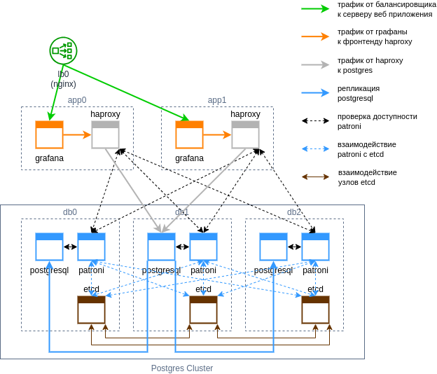

# Задание

Развернуть и настроить веб приложение, использующее PostgreSQL. Настроить кластер PostgreSQL patroni, etcd/consul/zookeeper и haproxy/pgbouncer.

# Подготовка к запуску

Публичный ключ должен находиться по пути: ```~/.ssh/id_rsa.pub```

В системе должны быть установлены ansible и terraform. Тестировалось на версиях:
- ansible [core 2.13.8]
  - community.postgresql 2.3.2
- terraform v1.5.5

# Запуск

В каталоге ```terraform``` выполнить ```terraform apply```

Дождаться запуска вм.

В каталоге ```ansible``` выполнить ```ansible-playbook setup.yaml```

При успешном выполнении плейбука в выводе terraform взять ip-адрес из ```nginx_public_ip_address``` и подключиться по http. Grafana будет доступна по основному локейшену ```/```, статистика HAProxy по локейшену ```/haproxy```.

# Схема проекта


